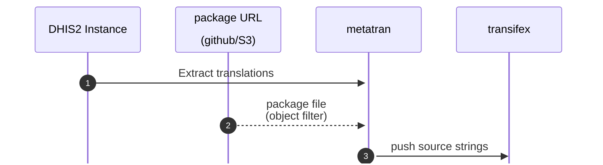
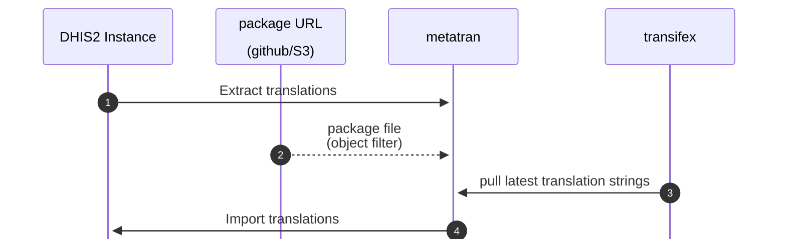
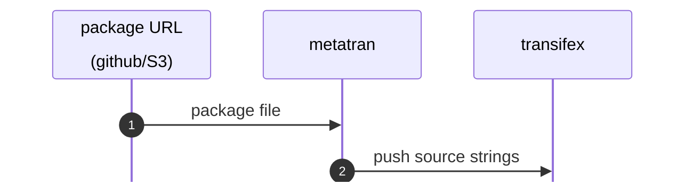
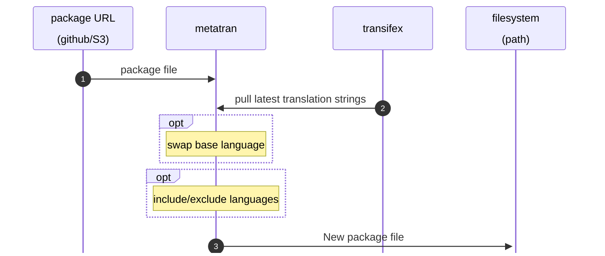
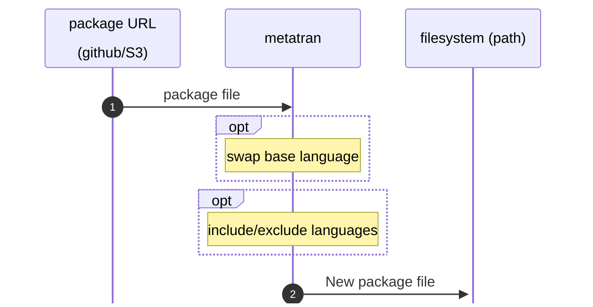

# DHIS2 metadata localisation and translation tool

Python script for managing translations for DHIS2 metadata and metadata packages.

```

usage: python3 ./metatran.py [mode] [options]

Square brackets in the descriptions show the environment variables that can be used
in place of some parameters.

mode:
--instance          manage translations in a DHIS2 instance (default if no mode option given)
or
--file              translate a metadata package file

instance options:
 -f package-url     [PACKAGE_FILE] full url to the initial package file
 -s server          [DHIS2_SERVER] full url to the DHIS2 instance
 -u user            [DHIS2_USER] DHIS2 user (should be a user with access to all objects)
 -p password        [DHIS2_PASSWORD] DHIS2 user password
 --push             push source strings to Transifex
 --pull             pull localised strings from Transifex

file options:
 -f package-url     [PACKAGE_FILE] full url to the initial package file
 -b old:new         change the base language from old language code to new language code
 -x list            exclude language in the comma-separated list of language codes
 -i list            include only languages in the comma-separated list of language codes
 --push             push source strings to Transifex (you probably DON'T want to do this)
 --pull             pull localised strings from Transifex
 -o file            path for the output package file

 transifex config (required when interacting with Transifex):
 --org org          [TX_ORGANISATION] Transifex organisation
 -t token           [TX_TOKEN] Transifex token
 --project slug     [TRANSIFEX_PROJECT] Transifex project slug
 -r slug            [TRANSIFEX_RESOURCE] Transifex resource slug

```

## Push translations from Instance into transifex


`python3 ./metatran.py --instance -s <dhis2-instance> -u <dhis2-user> -p <dhis2-password> [--filter <package url>] --project <transifex-project> -r <transifex-resource> --push`


## Pull translations from transifex into Instance

`python3 ./metatran.py --instance -s <dhis2-instance> -u <dhis2-user> -p <dhis2-password> [-f <package url>] --project <transifex-project> -r <transifex-resource> --pull`




## Push source strings for a package file to transifex

**You probably don't want to do this!**

`python3 ./metatran.py --file -f <package url> --project <transifex-project> -r <transifex-resource> --push`



## Pull translations for a package file (output to new file)

`python3 ./metatran.py --file -f <package url> --project <transifex-project> -r <transifex-resource> --pull [-b <old>:<new>] [-x <list> | -i <list>] -o <file>`



## Swap languages in package file (output to new file)

`python3 ./metatran.py --file -f <package-url> [-b <old>:<new>] [-x <list> | -i <list>] -o <file>`




