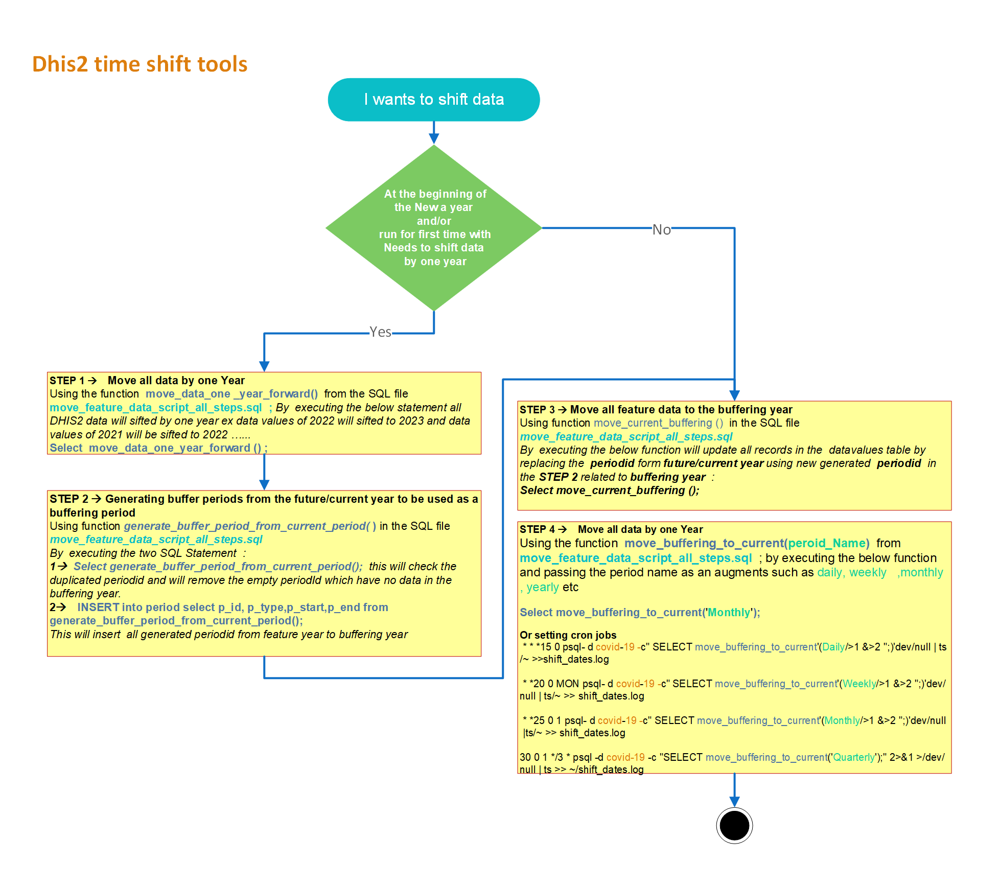

# DB Time Shift Utilities

This guide is composed of steps to achieve the primary goal of keeping the demos/tests database up to date.

Features of the system:

• Ensure data is not in the future.

• Ensure data is recent

• Script will be able to run periodically to bring data up to date

• Script will be able to apply to any DB following data import

------

**DB Time Shift Utilities -Work Flow** 



------

## Step 1 : move moving data from one year to the next / back

##### **Moving data might be used at the beginning of each year**

- Using the function  **move_data_one _year_forward()**  from the SQL file **move_feature_data_script_all_steps.sql**  ; By  executing the below statement all DHIS2 data will sifted by one year ex data values of 2022 will sifted to 2023 and data values of 2021 will be sifted to 2022 …...

Execution example:

```sql
    select move_data_one_year_forward ( );
```

The below step is not necessary unless you need to rollback the move forward data

  - Move data backward by using SQL file: `1.2-shift-all-data-one-year-backward.sql`

    Using function **move_data_one_year_backward ()** which will move all data, including Aggregate data and Tracker/Event data in the dhis2 database, backward by one year and tweak the dates to align periods correctly

    Execution example:

```sql
    select move_data_one_year_backward ( );
```

------

## Step 2: Generating buffer periods from the future/current year to be used as a buffering period

The buffering periods will be the same **periodId** for the future/current year with an extra two digits from the buffering year.

```sql
Example :

Future year is : 2022

Buffering year is : 2010

periodid for month like October 2022 is : 6171618

the new buffering periodid October 2010 will be : 617161810
```

  - **Generate buffering periods ids**

    Using function **generate_buffer_period_from_current_period( )** in the SQL file **move_feature_data_script_all_steps.sql**

    1. ```sql
       Select generate_buffer_period_from_current_period();
       ```
    
        The Above  will check the duplicated **periodid** and will remove the empty **periodId** which have no data in the buffering year.
    
    2. ```sql
       INSERT into period select p_id, p_type,p_start,p_end from generate_buffer_period_from_current_period();
       ```
    
       The above SQL line  will insert  all generated **periodid** from **feature year** to **buffering year**

------

## STEP 3 Move all feature data to the buffering year 

  - Using function **move_current_buffering ()**  in the SQL file **move_feature_data_script_all_steps.sql**
By  executing the below function will update all records in the  datavalues table by replacing the  periodid form future/current year using new generated  **periodid**  in the **STEP 2** related to **buffering year**  :  
    
```sql
    select move_current_buffering ();
```

------

## STEP 4: **Move data back from buffering year to the current period** 

  - Using the function  **move_buffering_to_current**(***peroid_Name***)  from   **move_feature_data_script_all_steps.sql**  ; by executing the below function and passing the period name as an augments such as **Daily**, **Weekly**   ,**Monthly** , **Yearly** etc 

    **Example**

    Create cron job for monthly period to move data from period of September 2010 to September 2022

    ```sql
    select move_buffering_to_current('monthly');
    ```


### Setting up a cron to keep your data up to date

An example below on how to make sure your data is updated when it corresponds by setting up a cronjob. We assume that you have data already in your system up to today's date. If that is not the case, you need to invoke the aforementioned functions to move it so it covers any date in the past until today.

First thing is to edit your crontab for user postgres, which is the one who has access to the DB. You need to run the following as superuser:

```shell
sudo crontab -e -u postgres
```

Add the following lines:

```shell
15 0 * * * psql -d covid-19 -c "SELECT move_buffering_to_current('Daily');" 2>&1 >/dev/null | ts >> ~/shift_dates.log
20 0 * * MON psql -d covid-19 -c "SELECT move_buffering_to_current('Weekly');" 2>&1 >/dev/null | ts >> ~/shift_dates.log
25 0 1 * * psql -d covid-19 -c "SELECT move_buffering_to_current('Monthly');" 2>&1 >/dev/null | ts >> ~/shift_dates.log
30 0 1 */3 * psql -d covid-19 -c "SELECT move_buffering_to_current('Quarterly');" 2>&1 >/dev/null | ts >> ~/shift_dates.log
```

Once your crontab is modified, please save and restart the service to make sure your changes take effect


```shell
sudo systemctl restart cron
```

Note: I have used ts to add a timestamp to the log. It can be installed by running "sudo apt install moreutils", but using it is optional. 2>&1 >/dev/null makes sure we only get the errors in the log, shift_dates.log which is saved in the home folder of user postgres
